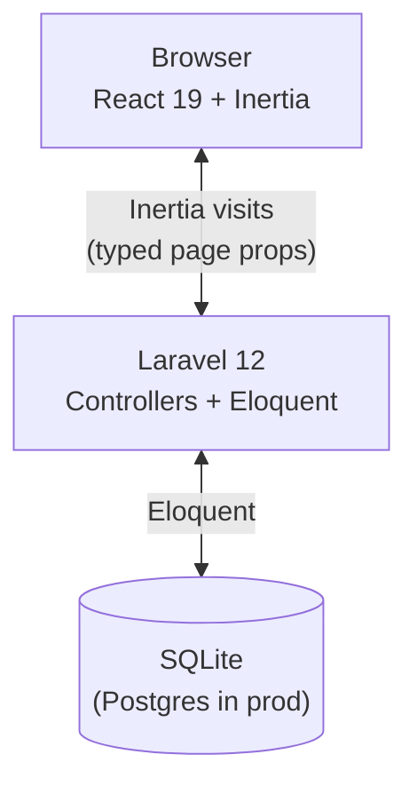
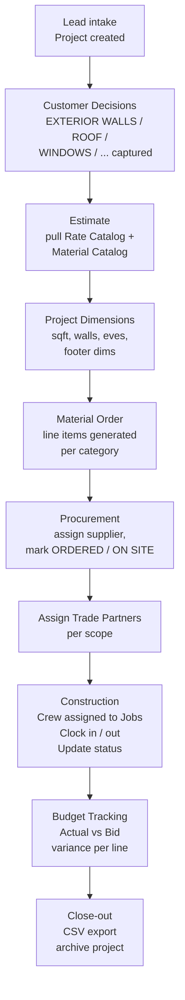
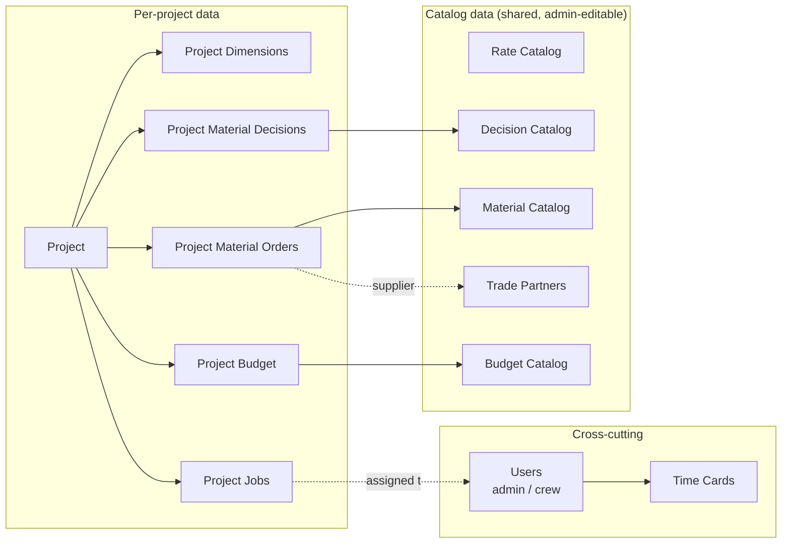

# BuffaloBuilt Internal — System Overview

> Internal operations app for a Wyoming-based general contractor, replacing a multi-sheet Excel workbook with a single source of truth.

---

## 1. Business Context

**BuffaloBuilt** is a residential & commercial general contractor operating across northern Wyoming — Sheridan, Buffalo, Gillette, Casper, Mills, Big Horn. They build custom homes, garages/shops, and remodels.

Current operations run out of one Excel workbook (`Copy of MATERIAL MASTER LIST.xlsx`) with **8 sheets** that conflate catalog data, project data, and copies of both:

| Sheet | Purpose | Status |
|---|---|---|
| **Rates** | Master cost catalog (labor/material/sub rates by cost code) | Authoritative |
| **Material Take off Guide** | How-to-calculate-quantity reference | Authoritative |
| **Material Order Template** | Per-project material order with auto-formulas | Authoritative |
| **Customer Material Decision List** | Per-project customer choices | Authoritative |
| **Trade Partner List** | Vendor & subcontractor directory | Authoritative |
| **Marys REVAMP** | Per-project bid-vs-actual budget tracker | Authoritative |
| Copy of Rates | Stale duplicate | Decommission |
| Copy of Material Take off Guide | Stale duplicate | Decommission |

### Operational pain points solved by this system

- **Duplication & drift** — "Copy of …" sheets diverge from masters. The DB holds one row, every project links to it.
- **Hand-entry of project dimensions** into every order. We store dimensions on the **Project** once.
- **No assignment / status** — no way to say "this material is ordered" or "Joe is on this job today." Today everything is `True`/`False` cells.
- **No time tracking** — paper or text-message clock-ins are reconciled manually.
- **No reporting** — variance reports require re-typing into a separate sheet.

---

## 2. Goals

1. Replace the workbook with a typed, multi-user web app.
2. Keep the **master data** (Rates, Materials, Trade Partners, Decision categories) editable by office staff but stable across all projects.
3. Make **per-project data** (decisions, orders, budget actuals, dimensions, time entries) first-class entities tied to a Project.
4. Give field crews a phone-friendly clock-in/clock-out and a list of jobs assigned to them today.
5. Produce CSV exports for accounting/payroll without re-typing.

---

## 3. Non-goals (v1)

- Customer-facing portal (the customer's "decision list" is filled out by office staff today; this stays internal).
- Auto-compute of material quantities from dimensions × formula (`05-implementation-plan.md` covers — formulas stored as text guidance in v1).
- Accounting / payroll integration (CSV export only).
- Mobile native app (responsive web only).
- Multi-tenant — one BuffaloBuilt deployment.

---

## 4. Users & Roles

Two roles in v1 (matches the lawnops template in [SYSTEM_TEMPLATE.md](SYSTEM_TEMPLATE.md)).

| Role | Who | Can do |
|---|---|---|
| **admin** | Office staff (estimators, project managers, owners) | Everything: manage users, all projects, all catalogs, all reports |
| **crew** | Field workers (framers, finishers, hauling) | Log in, clock in/out, see jobs assigned to them, mark jobs in-progress / complete, see project notes for their assigned jobs |

Role gating is enforced by the [EnsureUserIsAdmin](../app/Http/Middleware/EnsureUserIsAdmin.php) middleware (alias `admin`) on admin-only routes.

---

## 5. High-Level Architecture

Same stack as the lawnops template ([SYSTEM_TEMPLATE.md §3](SYSTEM_TEMPLATE.md)). Server-driven SPA via Inertia — no separate API.

---

## 6. Operational Workflow

This is what one project looks like from intake to close-out, end-to-end. Each box maps to a module documented in [03-modules.md](03-modules.md).

---

## 7. Data Domain at a Glance

The system splits cleanly into **catalogs** (shared across projects) and **project-scoped** entities. Full schema is in [02-data-model.md](02-data-model.md).

---

## 8. Success Criteria for v1

The system is "done v1" when the office can:

1. Create a Project, enter customer info + dimensions, and never touch the workbook for that project again.
2. Walk the customer through the Decision List inside the app, with each decision saved and confirmed.
3. Generate a per-project Material Order list and mark each item `ordered` / `on_site` from a phone in the field.
4. See a Trade Partner list filtered by trade and location.
5. Track Bid vs Actual at the budget-line level and export a variance report as CSV.
6. Have crew clock in/out and assign them to project jobs by date.
7. All admin actions are gated by role; crew can only see and act on their own assignments and time.

---

## 9. Document Map

| Doc | What's inside |
|---|---|
| [01-overview.md](01-overview.md) | this file |
| [02-data-model.md](02-data-model.md) | ERD, every table, every column, indexes, money-in-cents conventions |
| [03-modules.md](03-modules.md) | per-module CRUD, routes, pages, role permissions matrix |
| [04-xlsx-mapping.md](04-xlsx-mapping.md) | how each xlsx sheet translates to DB rows, with cleanup notes |
| [05-implementation-plan.md](05-implementation-plan.md) | phased rollout M0 → M8, what ships in each milestone |
| [SYSTEM_TEMPLATE.md](SYSTEM_TEMPLATE.md) | the lawnops blueprint we forked — keep for reference |
