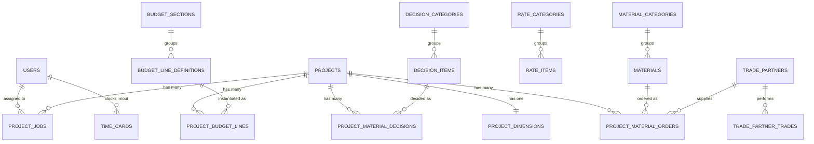

# BuffaloBuilt Internal — Data Model

Complete database schema. Naming follows Laravel conventions (snake_case tables/columns, plural table names). Migrations live in [database/migrations/](../database/migrations/).

---

## 1. Conventions

| Rule | Why |
|---|---|
| Money is stored as `*_cents` (`bigInteger`) | Avoids float rounding. Format at render. Matches [SYSTEM_TEMPLATE.md §9](SYSTEM_TEMPLATE.md). |
| All tables get `id` (bigInt PK) + `created_at` + `updated_at` | Laravel default |
| Catalog tables get an `is_active` boolean default true | Archive without delete; FK references stay intact |
| Status fields are strings (constants on the model) | Easier to read in queries than enum types; uses `STATUS_*` constants + `STATUSES` array for validation |
| Hard delete by default; soft delete only on `projects` and `users` | A deleted job/order shouldn't haunt the calendar; a deleted project must be recoverable |
| Pivot tables for many-to-many carry extra columns where useful (e.g. `trade_partner_trades.notes`) | Pattern from [SYSTEM_TEMPLATE.md §9](SYSTEM_TEMPLATE.md#9-notable-patterns-worth-keeping) |
| Foreign keys use `foreignId(...)->constrained()` with explicit `onDelete` | No orphan rows |
| Index every FK and every column used in `where` clauses (`role`, `status`, `scheduled_date`) | Sub-100ms queries on Wyoming-sized data (~thousands of rows, not millions) |

---

## 2. ERD Overview

---

## 3. Tables

### 3.1 `users`

Exists from M0 — see [database/migrations/0001_01_01_000000_create_users_table.php](../database/migrations/0001_01_01_000000_create_users_table.php).

| Column | Type | Notes |
|---|---|---|
| `id` | bigInt PK | |
| `name` | string | |
| `email` | string unique | login |
| `email_verified_at` | timestamp null | |
| `password` | string | bcrypt |
| `role` | string indexed | `admin` or `crew` |
| `remember_token` | string null | |
| `timestamps` | | |

Constants on model: `User::ROLE_ADMIN`, `User::ROLE_CREW`, `User::ROLES`. Helper: `$user->isAdmin()`.

### 3.2 `time_cards`

Open card has `clock_out_at = null`. A user can only have one open card at a time (enforced in [TimeCardController](../app/Http/Controllers/TimeCardController.php) — to come in M7).

| Column | Type | Notes |
|---|---|---|
| `id` | bigInt PK | |
| `user_id` | FK users | indexed |
| `project_job_id` | FK project_jobs nullable | indexed; clock-in can be untied to a job |
| `clock_in_at` | timestamp | |
| `clock_out_at` | timestamp null | null = currently clocked in |
| `notes` | text null | |
| `timestamps` | | |

Index on `(user_id, clock_out_at)` to find each user's open card fast.

### 3.3 `projects`

The customer + the build. One row per build (not per customer — a returning customer is a new project).

| Column | Type | Notes |
|---|---|---|
| `id` | bigInt PK | |
| `name` | string | e.g. "Staebler residence" |
| `customer_name` | string | |
| `customer_phone` | string null | |
| `customer_email` | string null | |
| `address` | string null | site address |
| `city` | string null | indexed (for filter) |
| `state` | string default "WY" | |
| `zip` | string null | |
| `first_meeting_at` | date null | |
| `rough_quote_at` | date null | |
| `contract_signed_at` | date null | |
| `target_completion_at` | date null | |
| `og_contract_price_cents` | bigInt null | original contract price |
| `current_contract_price_cents` | bigInt null | after change orders |
| `status` | string indexed | `lead` / `estimating` / `contracted` / `in_progress` / `closed` / `cancelled` |
| `notes` | text null | |
| `deleted_at` | timestamp null | soft delete |
| `timestamps` | | |

Indexes: `status`, `city`, `(status, deleted_at)`.

### 3.4 `project_dimensions`

1:1 with projects. Separated so the projects table stays lean and dimensions can be edited / audited without churning the project row. Field names match the xlsx **Material Order Template** header row.

| Column | Type | Notes |
|---|---|---|
| `id` | bigInt PK | |
| `project_id` | FK projects unique | one row per project |
| `wall_6in_lft` | decimal(10,2) null | "6\" WALL LFT" |
| `wall_4in_lft` | decimal(10,2) null | |
| `wall_6in_int_lft` | decimal(10,2) null | |
| `house_sqft` | decimal(10,2) null | |
| `garage_sqft` | decimal(10,2) null | |
| `roof_sqft` | decimal(10,2) null | |
| `valley_lft` | decimal(10,2) null | |
| `eve_lft` | decimal(10,2) null | |
| `eve_width` | decimal(10,2) null | |
| `rake_lft` | decimal(10,2) null | |
| `rake_width` | decimal(10,2) null | |
| `ext_house_wall_height` | decimal(10,2) null | |
| `ext_garage_wall_height` | decimal(10,2) null | |
| `int_house_wall_height` | decimal(10,2) null | |
| `int_garage_wall_height` | decimal(10,2) null | |
| `exterior_wall_lft` | decimal(10,2) null | |
| `exterior_wall_sqft` | decimal(10,2) null | |
| `interior_wall_lft` | decimal(10,2) null | |
| `interior_wall_sqft` | decimal(10,2) null | |
| `interior_ceiling_sqft` | decimal(10,2) null | |
| `footer_height_ft` | decimal(10,2) null | |
| `footer_width_ft` | decimal(10,2) null | |
| `slab_depth_ft` | decimal(10,2) null | |
| `timestamps` | | |

### 3.5 `material_categories`

From the **Material Order Template** category rows: CONCRETE, FRAMING, ROUGH SAWN, EXTERIOR DOORS, WINDOWS, SOFFIT FASCIA, ROOF, SIDING, INSULATION, DRYWALL AND PAINT, HVAC, PLUMBING, ELECTRICAL, CABINETS, VANITYS, INTERIOR DOORS, TRIM, INTERIOR FINISHES, FLOORING/TILE, APPLIANCES, MISC.

| Column | Type | Notes |
|---|---|---|
| `id` | bigInt PK | |
| `name` | string unique | "CONCRETE" |
| `sort_order` | smallInt default 0 | display order |
| `default_overage_percent` | smallInt default 0 | "PLUS 20%" / "PLUS 25%" |
| `notes` | text null | |
| `is_active` | bool default true | |
| `timestamps` | | |

### 3.6 `materials`

The catalog of buyable items. Pulled from **Material Take off Guide** + **Material Order Template** rows. One row per distinct item (e.g. "2x6x16", "8' EZ-forms", "Fiberglass rebar").

| Column | Type | Notes |
|---|---|---|
| `id` | bigInt PK | |
| `material_category_id` | FK material_categories | indexed |
| `name` | string | "2x6x16" |
| `description` | string null | "Exterior TP/interior 2x6 walls x2" |
| `unit` | string null | "EA", "LFT", "SQFT", "YD3" |
| `takeoff_formula` | text null | text guidance, e.g. "6\" WALL PERM X2/16" |
| `default_supplier_id` | FK trade_partners null | indexed; "CURRENT OPTIMAL SUPPLIER" |
| `default_supplier_text` | string null | free-text fallback ("H.D.", "MENARDS") for items without a TradePartner row |
| `sort_order` | smallInt default 0 | order within category |
| `notes` | text null | |
| `is_active` | bool default true | |
| `timestamps` | | |

Unique index on `(material_category_id, name)`.

### 3.7 `project_material_orders`

Per-project material line items. Materialized from `materials` once when an admin clicks "Generate from catalog" on a Project (or added ad-hoc). The xlsx's `True`/`False` columns become timestamps.

| Column | Type | Notes |
|---|---|---|
| `id` | bigInt PK | |
| `project_id` | FK projects | indexed |
| `material_id` | FK materials | indexed |
| `qty` | decimal(10,2) null | "QTY" — user enters; not auto-computed in v1 |
| `qty_unit` | string null | snapshot of material.unit at time of order |
| `description_override` | string null | per-project tweak ("Black wood grain") |
| `supplier_id` | FK trade_partners null | overrides material.default_supplier |
| `supplier_text` | string null | free-text override |
| `allowance_price_cents` | bigInt null | "ALLOWANCE PRICE/DIFFERENCE" |
| `actual_price_cents` | bigInt null | |
| `ordered_at` | timestamp null | "ORDERED" boolean → when |
| `on_site_at` | timestamp null | "ON SITE?" boolean → when |
| `ordered_by_user_id` | FK users null | who marked ordered |
| `notes` | text null | |
| `sort_order` | smallInt default 0 | preserves category grouping in UI |
| `timestamps` | | |

Unique index on `(project_id, material_id)` — one order line per material per project (use `description_override` or split into multiple `materials` if you really need two lines for the same material).

### 3.8 `decision_categories`

From the **Customer Material Decision List**: EXTERIOR WALLS, ROOF, WINDOWS, EXTERIOR DOORS, CONCRETE/FOUNDATION, LANDSCAPING, LIVING SPECIFIC, FLOORING, WALL FINISHES, CEILING, INSULATION, MILLWORK, HVAC, PLUMBING, BATHROOMS, KITCHEN, ELECTRICAL, GARAGE SPECIFIC, etc.

Note: different taxonomy than `material_categories`. Decisions are customer-facing; materials are procurement-facing.

| Column | Type | Notes |
|---|---|---|
| `id` | bigInt PK | |
| `name` | string unique | "EXTERIOR WALLS" |
| `scope` | string indexed | `living` / `garage` / `shared` (mirrors "GARAGE SPECIFIC" / "LIVING SPECIFIC") |
| `sort_order` | smallInt default 0 | |
| `notes` | text null | |
| `is_active` | bool default true | |
| `timestamps` | | |

### 3.9 `decision_items`

The catalog of sub-decisions inside a category. E.g. EXTERIOR WALLS has: Siding Material, Timber work, Soffit, Fascia.

| Column | Type | Notes |
|---|---|---|
| `id` | bigInt PK | |
| `decision_category_id` | FK decision_categories | indexed |
| `label` | string | "Siding Material" |
| `recommended` | string null | "EIFS" |
| `guidance` | string null | "Color and texture options in office" |
| `sort_order` | smallInt default 0 | |
| `is_active` | bool default true | |
| `timestamps` | | |

Unique on `(decision_category_id, label)`.

### 3.10 `project_material_decisions`

Per-project answers. Created lazily — one row per `decision_item` the office has actually discussed with the customer.

| Column | Type | Notes |
|---|---|---|
| `id` | bigInt PK | |
| `project_id` | FK projects | indexed |
| `decision_item_id` | FK decision_items | indexed |
| `budget_cents` | bigInt null | "BUDGET" column |
| `customer_decision` | string null | what they chose |
| `price_cents` | bigInt null | "PRICE" |
| `notes` | text null | |
| `confirmed_at` | timestamp null | "CONFIRMED?" boolean → when |
| `confirmed_by_user_id` | FK users null | |
| `timestamps` | | |

Unique on `(project_id, decision_item_id)`.

### 3.11 `rate_categories`

From the **Rates** sheet: 01 - PRELIMINARY WORKS, 02 - BUSINESS OPERATIONS, 03 - LAND & SITE IMPROVEMENT, 04 - CONCRETE, 05 - FRAMING, 06 - ROOFING/SIDING, 07 - PLUMBING, …

| Column | Type | Notes |
|---|---|---|
| `id` | bigInt PK | |
| `code` | string unique | "01", "02", … |
| `name` | string | "PRELIMINARY WORKS" |
| `sort_order` | smallInt | derived from code |
| `is_active` | bool default true | |
| `timestamps` | | |

### 3.12 `rate_items`

Cost-code rows like 01.05 Building Permit, 04.05 Stem Walls - Sub, 05.00 Framing Labor.

| Column | Type | Notes |
|---|---|---|
| `id` | bigInt PK | |
| `rate_category_id` | FK rate_categories | indexed |
| `code` | string indexed | "04.05", "01.10" |
| `name` | string | "Stem Walls - Sub" |
| `kind` | string indexed | `material` / `labor` / `sub` / `mixed` (matches the xlsx column-group it lives under) |
| `unit` | string null | "LF", "SF", "YD3", "HR", "DAY", "WEEK", "MONTH" |
| `fast_price_cents` | bigInt null | "FAST PRICE" column |
| `material_avg_cost_cents` | bigInt null | "MATERIAL AVG OUR COST" |
| `bb_install_rate_cents` | bigInt null | "BB INSTALL RATE OUR COST" |
| `subs_install_rate_cents` | bigInt null | "SUBS INSTALL RATE OUR COST" |
| `bill_rate_cents` | bigInt null | "Bill" |
| `markup_percent` | decimal(5,2) null | |
| `notes` | text null | "SUB/STORE PREFERENCE/NOTES" |
| `is_active` | bool default true | |
| `timestamps` | | |

Unique on `code`.

### 3.13 `budget_sections`

From **Marys REVAMP**: SOFT COSTS, SITEWORK COSTS, BUILDING COSTS (and others further down the sheet).

| Column | Type | Notes |
|---|---|---|
| `id` | bigInt PK | |
| `name` | string unique | "SOFT COSTS" |
| `sort_order` | smallInt | |
| `is_active` | bool default true | |
| `timestamps` | | |

### 3.14 `budget_line_definitions`

The catalog of budget items per section. E.g. SOFT COSTS has: Design Fees, Engineering, Planning and Specifications, Permits, Surveying, Insurance/Bonds, etc.

| Column | Type | Notes |
|---|---|---|
| `id` | bigInt PK | |
| `budget_section_id` | FK budget_sections | indexed |
| `name` | string | "Design Fees" |
| `sort_order` | smallInt | |
| `default_rate_item_id` | FK rate_items null | optional link to Rate Catalog for default pricing |
| `is_active` | bool default true | |
| `timestamps` | | |

Unique on `(budget_section_id, name)`.

### 3.15 `project_budget_lines`

The bid/actual variance grid the office fills in per project. Mirrors the **Marys REVAMP** grid layout exactly.

| Column | Type | Notes |
|---|---|---|
| `id` | bigInt PK | |
| `project_id` | FK projects | indexed |
| `budget_line_definition_id` | FK budget_line_definitions | indexed |
| `bid_sub_cents` | bigInt null | "Sub Cost — Bid" |
| `actual_sub_cents` | bigInt null | "Sub Cost — Actual" |
| `estimated_material_cents` | bigInt null | |
| `actual_material_cents` | bigInt null | |
| `estimated_labor_cents` | bigInt null | |
| `actual_labor_cents` | bigInt null | |
| `notes` | text null | |
| `timestamps` | | |

Unique on `(project_id, budget_line_definition_id)`.

Derived columns (computed in queries, not stored):
- `material_difference_cents` = `actual_material_cents - estimated_material_cents`
- `labor_difference_cents` = `actual_labor_cents - estimated_labor_cents`

### 3.16 `trade_partners`

The **Trade Partner List** — subcontractors and material suppliers.

| Column | Type | Notes |
|---|---|---|
| `id` | bigInt PK | |
| `name` | string | "Buchanan Excavating LLC" |
| `location` | string null indexed | "Gillette" / "Sheridan" / "Buffalo" / "Casper" / … |
| `phone` | string null | |
| `email` | string null | |
| `negotiated_price` | string null | free-text rate info |
| `how_we_know_them` | string null | "online", "referral", "yes" |
| `used_before` | bool default false | |
| `notes` | text null | |
| `is_active` | bool default true | |
| `timestamps` | | |

### 3.17 `trade_partner_trades`

Pivot. The xlsx "Trade" column concatenates multiple trades with `;` (e.g. "Cabinet Installer; Finish Carpentry; Framing/General Construction"). Normalize.

| Column | Type | Notes |
|---|---|---|
| `id` | bigInt PK | |
| `trade_partner_id` | FK trade_partners | indexed |
| `trade` | string indexed | "Cabinet Installer", "Concrete", "Cleaning", … |
| `timestamps` | | |

Unique on `(trade_partner_id, trade)`.

Trades enumerated from the xlsx (~60 distinct): Cabinet Installer, Cabinets, Cleaning, Concrete, Finish Carpentry, Flooring, Framing/General Construction, Tile Installer, etc. Seed an authoritative list as a string column rather than a separate `trades` table (it's a closed enum that rarely changes; a table would be over-engineering for v1).

### 3.18 `project_jobs`

A dated unit of work on a project, assigned to one or more crew members. Mirrors `service_jobs` in the lawnops template.

| Column | Type | Notes |
|---|---|---|
| `id` | bigInt PK | |
| `project_id` | FK projects | indexed |
| `title` | string | "Pour slab", "Frame upper walls" |
| `scheduled_date` | date | indexed |
| `scheduled_time` | time null | |
| `status` | string indexed | `scheduled` / `in_progress` / `completed` / `skipped` / `cancelled` |
| `started_at` | timestamp null | |
| `completed_at` | timestamp null | |
| `started_by_user_id` | FK users null | |
| `completed_by_user_id` | FK users null | |
| `notes` | text null | |
| `timestamps` | | |

Index `(project_id, scheduled_date)` and `(scheduled_date, status)` for crew dashboards.

### 3.19 `project_job_user`

Pivot — many crew members can be assigned to one job, one crew member can have many jobs.

| Column | Type | Notes |
|---|---|---|
| `id` | bigInt PK | |
| `project_job_id` | FK project_jobs | indexed |
| `user_id` | FK users | indexed |
| `timestamps` | | |

Unique on `(project_job_id, user_id)`.

---

## 4. Where this differs from lawnops

| lawnops | BuffaloBuilt | Why |
|---|---|---|
| `Client` (has many services) | `Project` (one-off build) | A house build is a single, dated project, not a recurring service customer |
| `Service` (catalog) | `Material` + `RateItem` (two catalogs) | We have both buyable things (materials) and cost codes (rates) |
| `RecurringSchedule` → `ServiceJob` | No recurring; `ProjectJob` only | Builds aren't recurring; the schedule is per-phase |
| `client_service` pivot with contract pricing | `project_material_orders` carries per-project pricing on the order itself | Same idea, different shape |
| Single category enum on `services` | Three category tables (`material_categories`, `decision_categories`, `rate_categories`) | The xlsx has three distinct taxonomies that don't overlap cleanly |

---

## 5. Open questions for later milestones

- **Change orders**: when contract price changes mid-build, do we version Projects or just update `current_contract_price_cents` + audit log? (M6 decision)
- **File attachments**: PDFs (plans, permits, photos) per Project. Use Laravel Filesystem with S3 in prod. (M5+)
- **Multi-location / multi-company**: out of scope for v1. If BuffaloBuilt ever spins off a sister company, revisit.
- **Auto-compute QTY from formulas**: deferred per scope decision — formulas are text guidance for v1.
