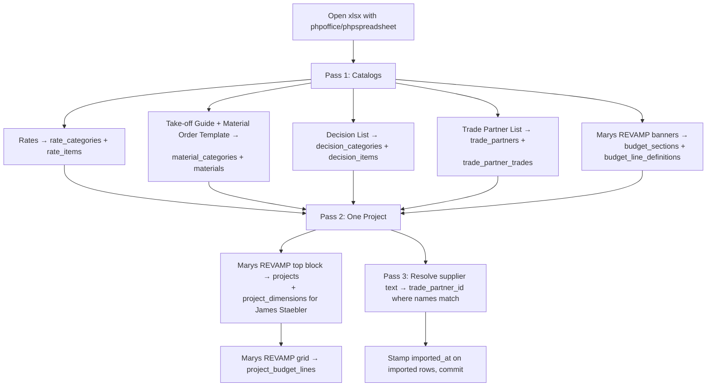

# BuffaloBuilt Internal — Spreadsheet → Database Mapping

Field-by-field translation of [`Copy of MATERIAL MASTER LIST.xlsx`](Copy%20of%20MATERIAL%20MASTER%20LIST.xlsx) into the schema defined in [02-data-model.md](02-data-model.md). Used by seeders to import the office's current data on first deploy.

The xlsx has **8 sheets**. Two are stale copies and are not imported. The remaining six map to specific tables described below.

| xlsx Sheet | Imported? | Target tables |
|---|---|---|
| Rates | yes | `rate_categories`, `rate_items` |
| Material Take off Guide | yes | `material_categories`, `materials` (catalog) |
| Material Order Template | partial | seeds `material_categories` ordering + `materials` not in the Take-off guide; per-project rows are created later |
| Copy of Rates | **no** | duplicate; archive on import |
| Copy of Material Take off Guide | **no** | duplicate; archive on import |
| Marys REVAMP | yes | `budget_sections`, `budget_line_definitions` |
| Customer Material Decision List | yes | `decision_categories`, `decision_items` |
| Trade Partner List | yes | `trade_partners`, `trade_partner_trades` |

---

## 1. Sheet: `Rates`

Authoritative cost catalog. Columns are nested under multi-row banners — the header is split across rows 2, 5, and the value columns vary by row.

### 1.1 Category rows

Pattern: column B contains text like `"01 - PRELIMINARY WORKS"`, `"02 - BUSINESS OPERATIONS"`. Everything in subsequent rows up to the next `NN - …` banner belongs to that category.

| xlsx token | DB target |
|---|---|
| `"01"` | `rate_categories.code` |
| `"PRELIMINARY WORKS"` (the text after `" - "`) | `rate_categories.name` |
| row offset | `rate_categories.sort_order` |

### 1.2 Cost-code item rows

Pattern: column B contains `"NN.NN Some Name - Sub"` / `"- Labor"` / `"- Material"` or just `"NN.NN Some Name"`. Example: `04.05 Stem Walls - Sub`.

| xlsx token | DB target | Notes |
|---|---|---|
| `04.05` | `rate_items.code` | unique |
| `"Stem Walls"` | `rate_items.name` | strip trailing ` - Sub` / ` - Labor` / ` - Material` |
| `"Sub"` / `"Labor"` / `"Material"` / (none) | `rate_items.kind` | `sub` / `labor` / `material` / `mixed` |
| `"FAST PRICE"` column | `rate_items.fast_price_cents` | dollar → cents on import |
| `"MATERIAL AVG OUR COST"` group | `rate_items.material_avg_cost_cents` | |
| `"BB INSTALL RATE OUR COST"` group | `rate_items.bb_install_rate_cents` | |
| `"SUBS INSTALL RATE OUR COST"` group | `rate_items.subs_install_rate_cents` | |
| `"Bill"` / `"Markup"` / `"Total"` group | `bill_rate_cents` / `markup_percent` | last col group at right edge |
| `"SUB/STORE PREFERENCE/NOTES"` (right-most text) | `rate_items.notes` | |

### 1.3 Sub-rows (rental rates, materials)

Some rate items have follow-on rows that list per-unit pricing (e.g. `Telehandler / Off-road man lift  Day 232  Week 1452  Month 4356`). These are absorbed into a **single** `rate_item` row whose `notes` field captures the unit pricing as text:

> *Reason*: introducing a separate `rate_item_unit_prices` table for ~30 rental items isn't worth the complexity. If pricing-per-unit becomes important in M6, we revisit.

### 1.4 Edge cases

- Row 1 has stray cells (`33.35`, `"All prices shown are our cost"`) — skip.
- Empty rows — skip.
- `#REF!` in row 7 — skip (broken formula in the source).
- Some items have no numeric data, only notes → still create the `rate_item` with all prices null; the office may fill them in later.

---

## 2. Sheet: `Material Take off Guide`

Reference catalog of materials grouped by **category** with the **how-to-take-off formula** as guidance text.

### 2.1 Category rows

Pattern: column A contains the category name in ALL CAPS or Title Case, no leading data in B–E. Examples: `"Concrete/ Foundation"`, `"TIMBER/ LOG FRAMING"`, `"FRAMING"`, `"Electrical"`, `"Plumbing"`.

| xlsx token | DB target |
|---|---|
| `"FRAMING"` (column A) | `material_categories.name` |
| row offset | `material_categories.sort_order` |
| (none in this sheet) | `material_categories.default_overage_percent` — set later from Material Order Template |

### 2.2 Item rows

Pattern: column A blank, column B contains the item name. Example: `"  | Studs |  |  | Perimeter: 1 stud per 1 sf +25% | HD"`.

| xlsx column | DB target | Notes |
|---|---|---|
| B – ITEM | `materials.name` | |
| C – USE | append to `materials.description` | |
| D – HOW TO TAKE OFF | `materials.takeoff_formula` | the formula as text |
| E – VENDOR/PREFERENCE | `materials.default_supplier_text` | until matched to a trade_partner |

### 2.3 Cleanup

- Many empty rows in this sheet — skip.
- Some rows have URLs in vendor column — keep them in `default_supplier_text`; the UI renders them as links.
- The sheet is sparse (~30 items defined out of 270 rows). Missing items get added from sheet `Material Order Template` (next).

---

## 3. Sheet: `Material Order Template`

This sheet is **both** a catalog (one row per material BuffaloBuilt orders, with the formula) **and** a sample project order. We import only the catalog portion.

### 3.1 Project-dimension banner (rows 1–5)

Columns A–L on rows 1–5 contain the project's dimensional inputs (`6" WALL LFT`, `HOUSE SQFT`, etc.). These are **per-project** values and do **not** seed into the catalog. They are the prototype for what `project_dimensions` will hold (see [02-data-model.md §3.4](02-data-model.md)).

### 3.2 Header row (row 6)

`CATEGORY | QTY | ITEM | EQUATIONS | SQFT/LFT | DESCRIPTION/COLOR | CURRENT OPTIMAL SUPPLIER | ORDERED | ON SITE? | ALLOWANCE PRICE/ DIFFERENCE | NOTES`

The "QTY" and "SQFT/LFT" columns are project-specific computed values — **not** part of the material catalog. They define the shape of `project_material_orders` (see [02-data-model.md §3.7](02-data-model.md)).

### 3.3 Category banner rows

Pattern: column A contains a category name (`CONCRETE`, `FRAMING`, `ROUGH SAWN`, …) and column D often contains `"PLUS 20%"` / `"PLUS 25%"` (the overage to apply when ordering).

| xlsx token | DB target |
|---|---|
| col A "CONCRETE" | `material_categories.name` (upsert) |
| col D `"PLUS 25%"` → `25` | `material_categories.default_overage_percent` |

### 3.4 Material item rows

Pattern: column A blank, column C contains the item name.

| xlsx column | DB target | Notes |
|---|---|---|
| C – ITEM | `materials.name` | |
| D – EQUATIONS | `materials.takeoff_formula` | overrides the Take-off Guide if present and different |
| F – DESCRIPTION/COLOR | append to `materials.description` | |
| G – CURRENT OPTIMAL SUPPLIER | `materials.default_supplier_text` | text only on import; matched to a `trade_partner_id` in a post-import step if name matches |
| K – NOTES | append to `materials.notes` | |

### 3.5 De-duplication

A material item may appear in both the Take-off Guide and the Material Order Template (e.g. `"Studs"` vs `"2x6x16"`). Rule of thumb:

1. The Material Order Template's items are the **buyable SKUs** (`2x6x16`, `8' EZ-forms`).
2. The Take-off Guide's items are the **conceptual entities** (`Studs`, `Bottom Plate`).
3. Where names overlap, the Take-off Guide's longer-form `HOW TO TAKE OFF` text is preferred for the formula; the SKU naming from Material Order Template is preferred for `materials.name`.

---

## 4. Sheet: `Customer Material Decision List`

Catalog of decisions the customer makes during the pre-construction interview.

### 4.1 Header row (row 3)

`CATEGORY | SUPPORTING | RECOMMENDED IN ESTIMATE | BUDGET | NOTES | DECISION | PRICE | CONFIRMED?`

The last 4 columns (`BUDGET`, `DECISION`, `PRICE`, `CONFIRMED?`) are **per-project** answers, not catalog. They map to `project_material_decisions` (see [02-data-model.md §3.10](02-data-model.md)).

### 4.2 Scope-banner rows

Rows like `"Garage-9'walls"`, `"Living-9'walls"`, `"LIVING SPECIFIC"`, `"GARAGE SPECIFIC"` indicate that subsequent decision categories belong to that scope.

| xlsx token | DB target |
|---|---|
| `"LIVING SPECIFIC"` / `"GARAGE SPECIFIC"` / `"Additional items"` | `decision_categories.scope` set to `living` / `garage` / `shared` for following rows |

### 4.3 Category & item rows

Pattern: column A holds the category in ALL CAPS (`EXTERIOR WALLS`, `ROOF`, `WINDOWS`, …). Column B holds the sub-decision label (`Siding Material`, `Truss style`, …).

| xlsx column | DB target |
|---|---|
| A – CATEGORY | `decision_categories.name` (upsert) |
| B – SUPPORTING (item label) | `decision_items.label` |
| C – RECOMMENDED IN ESTIMATE | `decision_items.recommended` |
| E – NOTES | `decision_items.guidance` |

### 4.4 Cleanup

- Rows with only a category in column A and nothing in B (e.g. `"Garage-9'walls"`) are scope hints — handled per §4.2 above, not as decision items.
- The merged-cell categories (`CONCRETE/ FOUNDATION`) include newlines in the source — strip whitespace.

---

## 5. Sheet: `Trade Partner List`

Subcontractor & supplier directory.

### 5.1 Header row

`Location | Trade | Potential Trade Partners | Used Before? | Negotiated Price | How do we know them? | Notes | Contact | Email`

### 5.2 Data rows

| xlsx column | DB target | Notes |
|---|---|---|
| Location | `trade_partners.location` | "Sheridan", "Buffalo", … may be blank for non-local |
| Trade | **split on `;`** → `trade_partner_trades.trade` (one row per trade) | "Cabinet Installer; Finish Carpentry" → 2 rows |
| Potential Trade Partners | `trade_partners.name` | |
| Used Before? | `trade_partners.used_before` | "yes" → true, anything else → false |
| Negotiated Price | `trade_partners.negotiated_price` | free text |
| How do we know them? | `trade_partners.how_we_know_them` | |
| Notes | `trade_partners.notes` | |
| Contact (phone) | `trade_partners.phone` | normalize formatting |
| Email | `trade_partners.email` | |

### 5.3 Cleanup

- Skip rows with blank `name` (column C).
- A few rows have phone in the "Email" column — detect with regex and swap.
- Some rows are headers/dividers — skip if `Trade` column matches a category name like `"Concrete"` without a vendor in C.

---

## 6. Sheet: `Marys REVAMP`

Per-project budget tracker, demonstrating the bid-vs-actual grid. The **layout** maps to `budget_sections` and `budget_line_definitions`; the **values** in this sheet are James Staebler's project and become a `projects` row + `project_budget_lines` rows.

### 6.1 Project information block (rows 2–5)

| xlsx label | DB target |
|---|---|
| `Project Name:` | `projects.name` ("James Staebler" → keep as project name) |
| `Contact Phone:` | `projects.customer_phone` |
| `Contact Email:` | `projects.customer_email` |
| `First Meeting:` | `projects.first_meeting_at` |
| `Rough Quote:` | `projects.rough_quote_at` |
| `Contract:` | `projects.contract_signed_at` |
| `OG Contract:` | `projects.og_contract_price_cents` |
| `Price/Sq. Ft.` | (derived; do not store) |
| `Home:` | `project_dimensions.house_sqft` |
| `Garage/Shop:` | `project_dimensions.garage_sqft` |
| `Other:` | (note on project) |

### 6.2 Section banners

`SOFT COSTS`, `SITEWORK COSTS`, `BUILDING COSTS`, plus more sections further down the sheet (kitchen, bath, finishes, …).

| xlsx token | DB target |
|---|---|
| `"SOFT COSTS"` (col B) | `budget_sections.name` |
| row offset | `budget_sections.sort_order` |

### 6.3 Header row (row 8 / 32 / 52)

`Budget Items |  | Notes | Bid | Actual | Estimated | Actual | Difference | Estimated | Actual | Difference`

Column groups (Sub / Material / Labor) define the column families on `project_budget_lines`. The `Difference` columns are derived (computed at read time).

### 6.4 Line rows

| xlsx column | DB target |
|---|---|
| Budget Items (col B) | `budget_line_definitions.name` (under current section) |
| Sub Cost — Bid | `project_budget_lines.bid_sub_cents` |
| Sub Cost — Actual | `project_budget_lines.actual_sub_cents` |
| Material Cost — Estimated | `project_budget_lines.estimated_material_cents` |
| Material Cost — Actual | `project_budget_lines.actual_material_cents` |
| Labor Cost — Estimated | `project_budget_lines.estimated_labor_cents` |
| Labor Cost — Actual | `project_budget_lines.actual_labor_cents` |
| Notes | `project_budget_lines.notes` |

### 6.5 Cleanup

- Rows like `"Total (Actual)"` — skip (derived).
- Rows like `"Concrete"` with no values (just a sub-heading) — skip (use the section banner as the grouping).
- `"15% Adder for General Labor"` and `"20% Adder for General Labor"` — store as regular budget line definitions; the math is in the report logic, not the schema.

---

## 7. Import / Seed Strategy

A one-off Artisan command pulls the workbook into the DB on first deploy.

```bash
php artisan bb:import-master-list docs/Copy\ of\ MATERIAL\ MASTER\ LIST.xlsx
```

Plan:



**Properties**:

- **Idempotent**: re-running uses upserts keyed on `code` / `(category, name)` / `email` so it never duplicates.
- **Reversible**: every imported row gets an `imported_at` timestamp. A companion `bb:import-master-list --rollback` deletes everything imported by the most recent run.
- **Non-destructive of user edits**: by default the importer does **not** overwrite columns that have been hand-edited since the last import (compare `updated_at > imported_at`). Pass `--force` to override.

The import command lives at [app/Console/Commands/ImportMasterListCommand.php](../app/Console/Commands/ImportMasterListCommand.php) (M2 deliverable).

---

## 8. Things in the xlsx we intentionally do not import

- **"Copy of Rates"** and **"Copy of Material Take off Guide"** sheets — duplicates, often stale.
- Cells with `#REF!` or `#DIV/0!` — broken formulas.
- Cell-level styling (colors / fonts) — meaningless once data is normalized.
- The unit-pricing sub-rows under rental items (Day / Week / Month rates) — captured as notes text on the parent rate item, not separate columns.
- Inline images or URL hyperlinks beyond plain text — captured as text only (the URL is preserved as a string).
